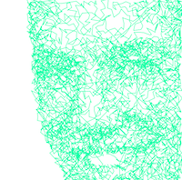
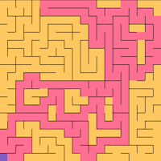

# Hi, I'm Urban Etter

This is a collection of some experiments, unfinished side projects and some written down thoughts. Most of the stuff has something to do with programming. You can reach me on [Twitter](https://twitter.com/urbmc) or [LinkedIn](https://www.linkedin.com/in/urban-etter/).

## p5js
Some more recent stuff. I love the simplicity and visuality of p5js. Here are some experiments I did with it:

### seems different from far away

This is a collaboration with [Probiere bringts](https://www.instagram.com/probiere_bringts). The aim was to draw an image with one stroke, so it can also easily be plotted: [Demo](p5js/faraway), [p5.js Editor sketch](https://editor.p5js.org/urban/sketches/_wJiaSFMS)

### maze gernerator, a* path finder implementation

Click in the grid for setting a start point, then a maze gets generated. A second click sets the target for the A* path find algorithm: [Demo](p5js/maze), [p5.js Editor sketch](https://editor.p5js.org/urban/sketches/1V9ImiKsw)

## artificial jass intelligence
It started with an experiment, how much effort it would take to teach a computer to play Jass, a Swiss card game. Like a lot of side projects, this project is completed about 80%. But I keep coming back to it every 6 to 12 month or so, so I might finish it at some point.... [Repo](https://github.com/urbanetter/jassy)

## blog posts
Back in the days when I wanted to start a blog I actually wrote some posts about software engineering stuff. 

There is a post about [Security](written/on-security.md), one about composition over inheritance called [in favour of behaviours](written/in-favour-of-behaviours.md), one about [programming style](written/webdevelopment-for-humans.md) and finally one I was excited about [web components](written/web-components.html).

## conference speaker
For some reasons, I had the pleasure to speak at some international conferences:

* Frontend conference, Zurich 2013, about [Frontend performance](talked/frontend_performance.html)
* Ez Publish conference, New York 2015, a short talk about the ez publish project at work
* Web summer camp, Rovinj 2016, about [APIs](https://2016.websummercamp.com/eZ-Publish/Practical-APIs-with-eZ-Publish-eZ-Platform)

