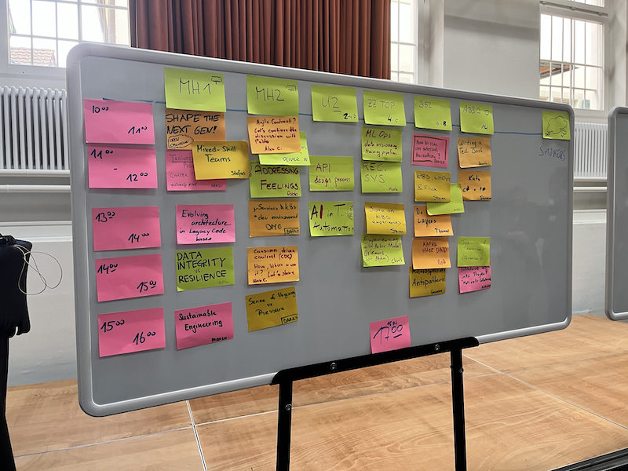

# SoCraTes Day 2022
Last Friday was the 2022 installment of the SoCraTes Day, an unconference about software craftsmanship and testing. I always planned on attending a SoCraTes day but didn't find time to do it. Now the stars aligned and finally I nudged myself over to visit it for the first time.

[SoCraTes Day](https://socrates-day.ch/) is an unconference, this means that the talks are not defined in advance but rather all attendees can propose a talk, a discussion, or something for given time slots.

The result was this:

There were surprisingly (for me at least) a lot of soft-skill slots. I did not expect this at a SoCraTes Day but it certainly made a lot of sense, because after all, soft skills are a big part of successful coding. Another big difference to other conferences I've been to is that the attendees of a talk are not restricted to just listening but are encouraged to actively participate in a discussion stemming from the talk. I liked that a lot.

Some sessions I attended:

## Writing a tech book
[Dominik Berner](https://twitter.com/BernerDominik) talked about writing a tech book. How the process worked and how it turned out for him. I was impressed by the openness Dominik talked about his endeavor and also made my secret plans to write a book... well,  obsolete :) (But basically because it's just too much work for me ;)

## Addressing feelings
This was also more of a soft-skill session. [Pablo](https://twitter.com/escodebar_) talked about how you could find out which feel you or someone else is feeling by asking a question.  The feelings he presented were reduced to 4 feelings: Happyness, Anger, Sadness, and Anxiety. There was a sentence for each feeling which could be used "to detect" the feeling. For me, this was a reminder that everything, also Software development has a lot to do with feelings. It also reminded me of a book that I wanted to read but haven't come around to yet: [Atlas of the heart](https://www.orellfuessli.ch/shop/home/artikeldetails/A1061820362), by Brené Brown, in which she explains not less than 86 different feelings.

## Evolving architecture in legacy code bases
This was my talk :) I wanted to talk about how to deal with code bases which have been written maybe a decade ago and how to deal with them as a software developer. I feel there is an urge of a lot of software developers to rewrite every code base from the scratch. But this is not always the best solution since there is a lot of legacy software that just works for a business. Rewriting this might bring you to the place where you have to introduce the bugs of the legacy code to your new application. Later that day I learned that the pattern we're using at work to *not* rewrite a code base has a name and Martin Fowler had already [written](https://martinfowler.com/bliki/StranglerFigApplication.html) about it in 2004 :). For those who care: it's called "The strangler fig pattern" :) Oh, and here are the [slides](assets/evolving-architecture.pdf) I used in case you're interested.

I liked the discussion which evolved after the talk more than my talk itself. The questions arose about how to push something like developer experience (DX) as a value, a business should be interested in.  A topic I'm dealing with at work and was interested in getting other views on it.

